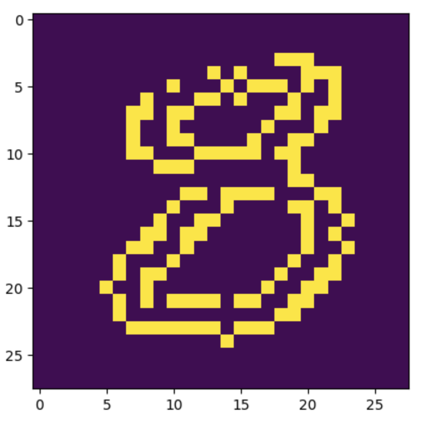
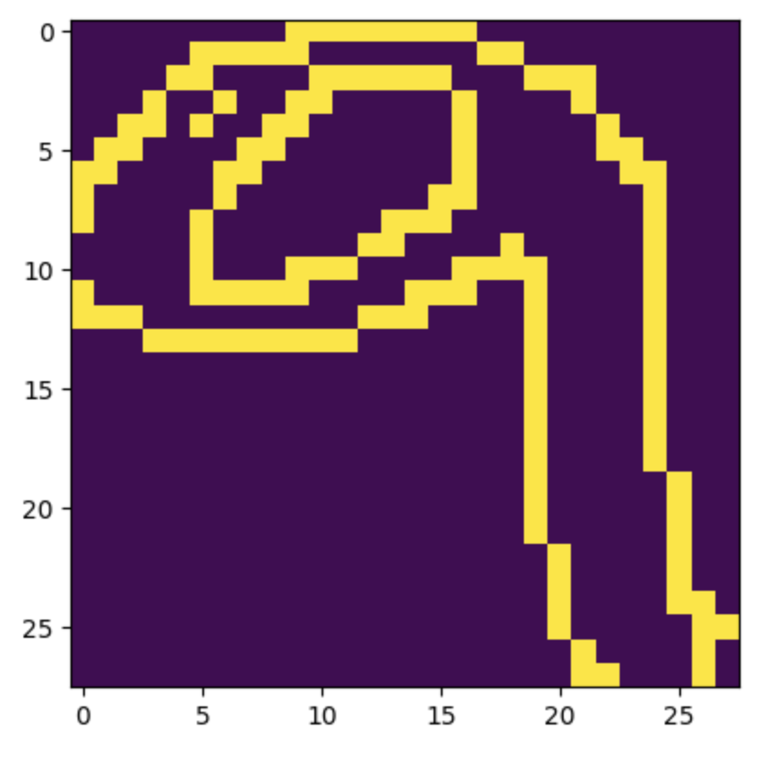
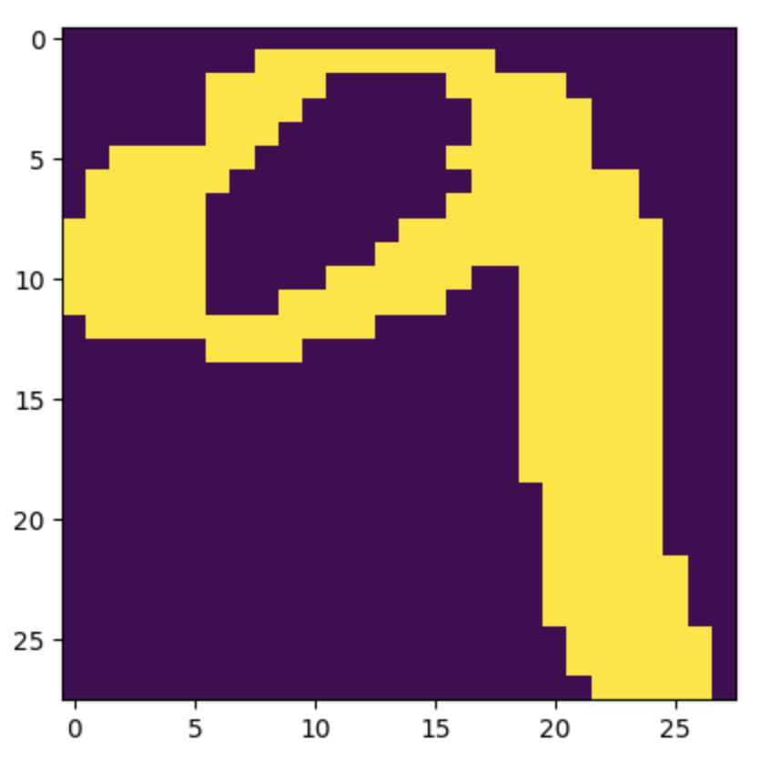
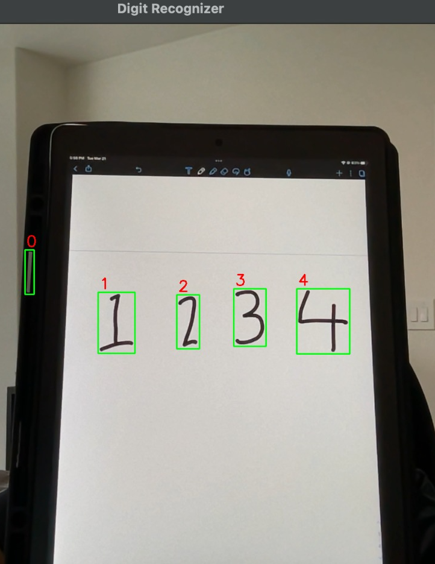

# Real-Time Digit Detection System
This Real-Time Digit Detection application allows users to utilize their webcam or input video file to recognize digits in the video. The application will automatically detect digits in the frame, which will be be accompanied by bounding boxes around each digit, along with their predicted digit value above each bounding box. 

## The Model
| Layer (type)       | Output Shape        |
| ------------------ | ------------------- |
| conv2d             | (None, 26, 26, 64) |
| activation         | (None, 26, 26, 64) |
| max_pooling2d      | (None, 13, 13, 64) |
| conv2d_1           | (None, 11, 11, 64) |
| activation_1       | (None, 11, 11, 64) |
| max_pooling2d_1    | (None, 5, 5, 64)   |
| conv2d_2           | (None, 3, 3, 64)   |
| activation_2       | (None, 3, 3, 64)   |
| max_pooling2d_2    | (None, 1, 1, 64)   |

The model was developed using Tensorflow Keras. Implemented three convolutional layers, accompanied by two fully connected layers with Relu and Softmax activation functions. Compiled the model with the sparse categorical cross-entropy loss function, Adam optimizer, and accuracy as the evaluation metric. The model achieved a test accuracy of 98%, indicating the model's ability to classify handwritten digits effectively.

## Otsu Thresholding
I employed Otsu thresholding as a crucial step in the image processing pipeline. Otsu thresholding was chosen for its ability to automatically determine an optimal threshold value to distinguish foreground (digits) from the background in the input images.

By using Otsu thresholding, I aimed to maximize the separation between the foreground and background pixels, enabling accurate and efficient digit segmentation. This technique allowed me to effectively isolate the digits of interest, regardless of variations in lighting conditions, image noise, or background complexity.

Otsu thresholding not only simplified the segmentation process but also enhanced the overall performance of the digit recognition system. By obtaining clean and well-defined digit regions, subsequent stages of the system, such as feature extraction and classification, could focus on the relevant information, leading to improved accuracy and robustness.

The use of Otsu thresholding eliminated the need for manual threshold selection and ensured adaptability to different types of input images, making the digit recognition system more versatile and capable of handling a wide range of digit patterns. Overall, Otsu thresholding played a vital role in achieving reliable and efficient digit recognition results in my system. Below are examples of the MNIST digits before and after applying Otsu thresholding.

|       Before        |         After        |
| ------------------ | ------------------- |
|  |  |
|  |  |

## Result

## Requirements
- Python 3
- OpenCV
- Tensorflow.keras 
- Numpy
- Tkinter

## To Run
1) Make sure all the requirments are installed properly before running the application.

2) Using either terminal/command prompt, navigate into the project directory.

3) To run the application, run the following command:
>> python app.py

4) You will be prompted with a menu system with three options: 
>> [1] Open internal camera.   [2] Open external camera.   [3] Open video file.

5) Pick [1] or [2] to utilize either your internal or external webcam, respectively, to recognize digits. 

## Usage

- Pick [1] or [2] to utilize either your internal or external webcam, respectively, to recognize digits. You will need to present your camera with a blank paper which contains a series of handwritten digits.

- Pick [3] to select a video file to recognize digits.
### Note:
- To demo option [3], you may use the provided sample video file, located in the project directory, labeled:
>> vid_sample.mov

## Limitations
To ensure that the application runs smoothly, please make sure to consider the following:
- When using option [1] or [2], use your webcam facing a plain background with minimal background decors, furniture, etc. Failing to do so will result in the application to pick up various contours in the background, making the application perform slow. 
- Be sure to write your numbers in a large, readable format on a BLANK, WHITE piece of paper, so that the application can detect digits more efficiently.

## Credits
- MNIST dataset was used to train the Convolutional Neural Network model, 'model.h5.'
- Full implementation of the CNN model can be found in:
>> mnist_cnn.ipynb
