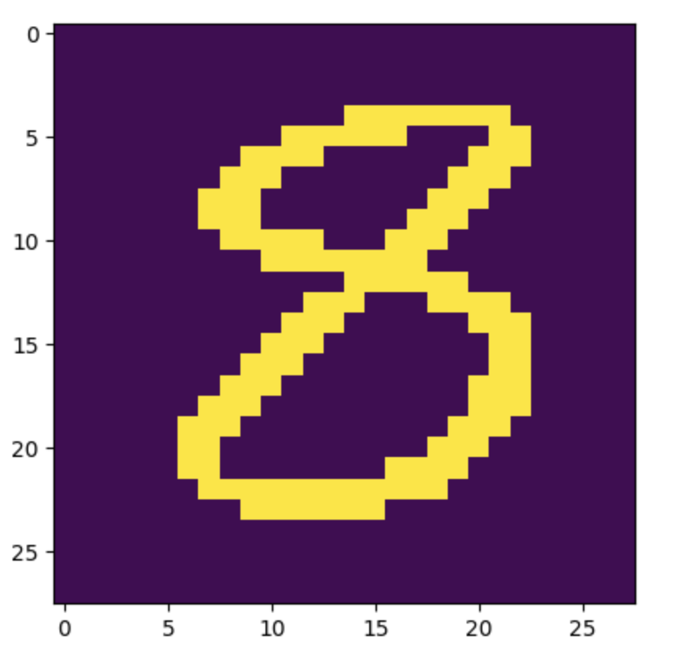

# Real-Time Digit Detection System
The Digit Detection System is a powerful computer vision application that I have developed to accurately identify and recognize handwritten digits. It utilizes state-of-the-art techniques, particularly convolutional neural networks (CNNs), to achieve precise digit detection within images.

## Introduction
This system is designed to address the need for automated digit recognition in various domains, including postal sorting, check processing, and form/document analysis. By leveraging advanced algorithms and machine learning, the system can effectively analyze the distinctive patterns and shapes of handwritten digits, ensuring accurate classification.

## Key Features
**Robust Digit Recognition:** The system employs sophisticated preprocessing techniques, feature extraction, and CNN-based classification algorithms to ensure robust and reliable digit detection.
**Versatility:** It can handle diverse handwriting styles, variations in digit appearance, and different writing utensils, making it suitable for a wide range of digit recognition scenarios.
**High Accuracy:** Through extensive training on labeled datasets, the system has achieved exceptional accuracy in digit detection, ensuring precise and reliable results.
**Efficiency and Productivity:** By automating the digit recognition process, the system significantly improves efficiency, reduces errors, and enhances productivity in various industries and applications.

## CNN Model
| Layer (type)       | Output Shape        |
| ------------------ | ------------------- |
| conv2d             | (None, 26, 26, 64) |
| activation         | (None, 26, 26, 64) |
| max_pooling2d      | (None, 13, 13, 64) |
| conv2d_1           | (None, 11, 11, 64) |
| activation_1       | (None, 11, 11, 64) |
| max_pooling2d_1    | (None, 5, 5, 64)   |
| conv2d_2           | (None, 3, 3, 64)   |
| activation_2       | (None, 3, 3, 64)   |
| max_pooling2d_2    | (None, 1, 1, 64)   |

The CNN model implementation described in the given model summary consists of several layers for image processing. Each layer performs specific operations on the input data, gradually transforming it to extract meaningful features.

The model begins with a conv2d layer, which applies a 2-dimensional convolution operation to the input data. This layer has an output shape of (None, 26, 26, 64), indicating that it produces 64 feature maps with a spatial resolution of 26x26.

The activation layer follows the convolutional layer, applying an activation function to introduce non-linearity into the model. It preserves the same output shape as the previous layer, (None, 26, 26, 64).

Next, a max_pooling2d layer is applied to downsample the feature maps by selecting the maximum value within a defined window. This process reduces the spatial dimensions of the feature maps, resulting in an output shape of (None, 13, 13, 64).

The model continues with additional conv2d, activation, and max_pooling2d layers, gradually reducing the spatial dimensions. These layers operate similarly to the initial layers, but with smaller feature map sizes. The subsequent layers have output shapes of (None, 11, 11, 64), (None, 5, 5, 64), (None, 3, 3, 64), and (None, 1, 1, 64).

The activation layers introduce non-linearity to the model, allowing it to learn complex patterns and representations from the input data. The max-pooling layers reduce the spatial dimensions, aiding in capturing the most relevant information while also improving computational efficiency.

Overall, this CNN model implementation utilizes a series of convolutional, activation, and max-pooling layers to process the input data. By gradually reducing the spatial dimensions and increasing the number of channels (features), the model learns to extract and identify important features in the input images.

## Otsu Thresholding
I employed Otsu thresholding as a crucial step in the image processing pipeline. Otsu thresholding was chosen for its ability to automatically determine an optimal threshold value to distinguish foreground (digits) from the background in the input images.

By using Otsu thresholding, I aimed to maximize the separation between the foreground and background pixels, enabling accurate and efficient digit segmentation. This technique allowed me to effectively isolate the digits of interest, regardless of variations in lighting conditions, image noise, or background complexity.

Otsu thresholding not only simplified the segmentation process but also enhanced the overall performance of the digit recognition system. By obtaining clean and well-defined digit regions, subsequent stages of the system, such as feature extraction and classification, could focus on the relevant information, leading to improved accuracy and robustness.

The use of Otsu thresholding eliminated the need for manual threshold selection and ensured adaptability to different types of input images, making the digit recognition system more versatile and capable of handling a wide range of digit patterns. Overall, Otsu thresholding played a vital role in achieving reliable and efficient digit recognition results in my system. Below are examples of the MNIST digits before and after applying Otsu thresholding.

|       Before        |         After        |
| ------------------ | ------------------- |
|  |  |
|  |  |

## Result

## Requirements
- Python 3
- OpenCV
- Tensorflow.keras 
- Numpy
- Tkinter

## To Run
1) Make sure all the requirments are installed properly before running the application.

2) Using either terminal/command prompt, navigate into the project directory.

3) To run the application, run the following command:
>> python app.py

4) You will be prompted with a menu system with three options: 
>> [1] Open internal camera.   [2] Open external camera.   [3] Open video file.

5) Pick [1] or [2] to utilize either your internal or external webcam, respectively, to recognize digits. 

## Usage

- Pick [1] or [2] to utilize either your internal or external webcam, respectively, to recognize digits. You will need to present your camera with a blank paper which contains a series of handwritten digits.

- Pick [3] to select a video file to recognize digits.
### Note:
- To demo option [3], you may use the provided sample video file, located in the project directory, labeled:
>> vid_sample.mov

## Limitations
To ensure that the application runs smoothly, please make sure to consider the following:
- When using option [1] or [2], use your webcam facing a plain background with minimal background decors, furniture, etc. Failing to do so will result in the application to pick up various contours in the background, making the application perform slow. 
- Be sure to write your numbers in a large, readable format on a BLANK, WHITE piece of paper, so that the application can detect digits more efficiently.

## Credits
- MNIST dataset was used to train the Convolutional Neural Network model, 'model.h5.'
- Full implementation of the CNN model can be found in:
>> mnist_cnn.ipynb
